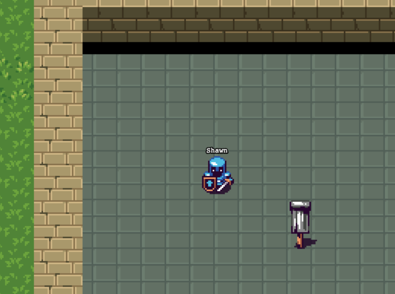

# Capture the flag (working title)

[](https://travis-ci.org/crisu83/ctf-game)
[](https://codeclimate.com/github/crisu83/ctf-game)
[](https://badge.fury.io/gh/crisu83%2Fctf-game)

Fast-paced hot seat multiplayer game written in modern JavaScript.



## Concept in a nutshell

- Players automatically join the weakest of the four teams, each team has its own color
- The idea is to tag flags for your team by running over them while kill enemy players
- Teams receive points during the match based on how many flags they have tagged
- When the match ends, the team with the highest score wins!

## Built with

This experiment mixes some of the most popular JavaScript tools.

- [Express](http://expressjs.com/) - Web server
- [SocketIO](http://socket.io/) - Real-time communication
- [Redux](http://redux.js.org/) - Predictable state container
- [Immutable](https://facebook.github.io/immutable-js/) - Immutable collections
- [React](https://facebook.github.io/react/) - User interface components
- [Phaser](http://phaser.io/) - Game framework
- [Lodash](https://lodash.com/) - Utility library
- [Babel](https://babeljs.io/) - EcmaScript6 transpiler
- [ESLint](http://eslint.org/) - Linting utility
- [Webpack](https://webpack.github.io/) - Module bundler
- [Mocha](https://mochajs.org/) - Testing framework
- [Chai](http://chaijs.com/) - Assertion library

## Checklist

This is my TODO list and also the road map for this project.

- [x] Game server
- [x] Game client
- [x] Client to server communication
- [x] Create player on the server
- [x] Send game state to clients
- [x] Create entities from state
- [x] Load spritesheets in clients
- [x] Update game logic from state
- [x] Send player actions to server
- [x] Read assets and tilemap on the server
- [x] Send game data to clients
- [x] Load assets and tilemap in clients
- [x] Render tilemap
- [x] Collision detection
- [x] Basic physics
- [ ] Teams and points
- [ ] Game logic

## Development

Run the following commands to start the development server:

```
npm install
npm run start:dev
```

Alternatively you can run the production server with:

```
NODE_ENV=production npm build
NODE_ENV=production npm start
```

## Running tests

Run the following command to run the test suite:

```
npm test
```

## Contributing

This project is still under active development, so I am not actively looking for contributors. 
However once the first version is ready and released I will add more details instructions on how you can contribute.

## License

See [LICENSE](LICENSE).
